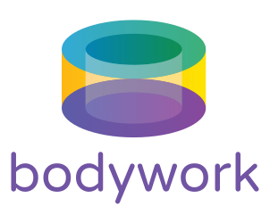

<div align="center">

</div>

<div align="center">


</div>

---

This repository contains the documentation for Bodywork. It has been built using [MkDocs](https://www.mkdocs.org) with the [Material](https://squidfunk.github.io/mkdocs-material/) theme. 

## Versioning

The version contained in the `VERSION` file will track the minor version of `bodywork-core` and will be used to tag the `master` branch.

## Serving the Docs Locally

To serve the docs locally, install the requirements listed in `requirements.txt` and then run,

```shell
$ mkdocs serve
```

## Hosting on Read the Docs

These docs are hosted on [Read the Docs](https://readthedocs.org) and the configuration for this service is contained in the `.readthedocs.yml` file. The latest live version can be found [here](https://bodywork.readthedocs.io/en/latest/).
