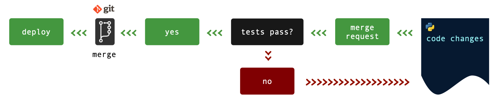
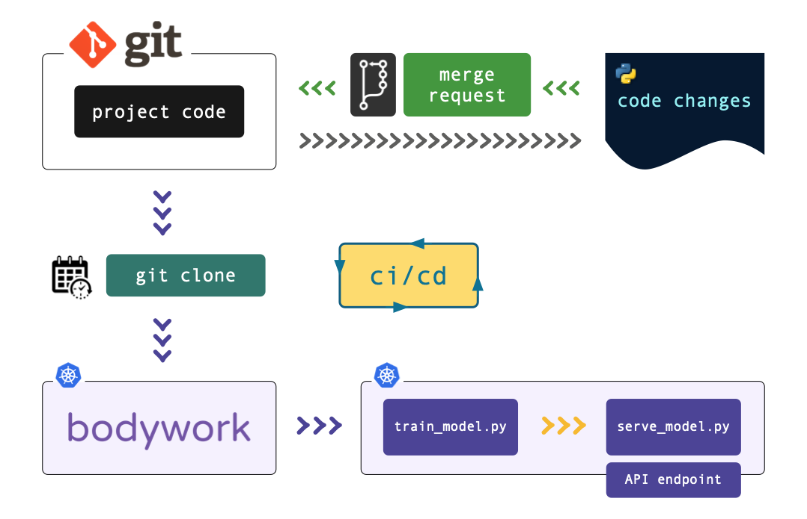

# CI/CD for Machine Learning

Continuous Integration (CI) and Continuous Deployment (CD) form the backbone of modern DevOps. This section demonstrates how to setup CICD for a Bodywork ML project.

## Example Project - ML Pipeline

The [bodywork-pipeline-with-cicd](https://github.com/bodywork-ml/bodywork-pipeline-with-cicd) repository contains a Bodywork pipeline that has been setup for CICD, using the [CircleCI](https://circleci.com) CI service (as used at Bodywork HQ). We'll describe how CICD has been setup using Circle CI, but the concepts will translate easily to other services of the same kind - e.g [GitHub Actions](https://docs.github.com/en/actions), [Travis CI](https://travis-ci.org), [Jenkins](https://www.jenkins.io), etc.

### Project Structure

The repo contains a pipeline with two stages - train-model and serve-model - and is discussed in more detail in the [Deploy ML Pipeline Quickstart Tutorial](quickstart_ml_pipeline.md). The structure of the repo is as follows:

```text
root/
 |-- .circleci/
     |-- config.yml
 |-- notebooks/    
     |-- ml_prototype_work.ipynb
 |-- pipeline/
     |-- __init__.py
     |-- serve_model.py
     |-- train_model.py
 |-- tests/
     |-- __init__.py
     |-- test_serve_model.py
 |-- bodywork.yaml
 |-- requirements_cicd.txt
 |-- requirements_dev.txt
```

`.circleci/config.yml`
: Configuration for the CICD pipeline, using CircleCI.

`notebooks`
: Jupyter notebooks used during the Exploratory Data Analysis (EDA) phase of the project.

`pipeline/*`
: Directory of Python modules that define the ML pipeline.

`tests/*`
: Automated tests for the pipeline's key functions, written using [pytest](https://docs.pytest.org/en/latest/).

`bodywork.yaml`
: Bodywork deployment configuration file - see the [User Guide](user_guide.md) for more information.

`requirements_cicd.pkg`
: Python packages needed by the CICD pipeline for running tests and deploying the pipeline.

`requirements_dev.pkg`
: Python packages needed for local development and testing.

### CI/CD Workflow



The typical CICD workflow is shown in the diagram above, going from right-to-left:

1. The codebase is changed and a request to merge the changes is created.
2. The merge request triggers automated tests to run on the branch containing the changes.
3. If the tests pass, then the request is cleared for integration into the master (or main) branch, subject to peer review, etc.
4. Once the new code is merged, then an automatic deployment stage can be triggered to release the changes.

In the sections below we will describe how to setup a full CICD pipeline, using Bodywork to manage the deployment stage.

## CD with Bodywork in a CI Service

The easiest way to integrate Bodywork with an existing CICD pipeline, is to configure it to deploy a project in a dedicated step that executes after tests have passed and the new code branch has been merged. The CICD pipeline configuration for the test project, using CircleCI, is shown below.

```yaml
version: 2.1

orbs:
  aws-eks: circleci/aws-eks@1.0.3

jobs:
  run-tests:
    docker: 
      - image: circleci/python:3.8
    steps:
      - checkout
      - run:
          name: Installing Python dependencies
          command: |
            pip install -r requirements_cicd.txt
            pip install -r requirements_dev.txt
      - run: 
          name: Running tests
          command: pytest
  trigger-bodywork-deployment:
    executor:
      name: aws-eks/python
      tag: "3.8"
    steps:
      - aws-eks/update-kubeconfig-with-authenticator:
          cluster-name: bodywork-dev
      - checkout
      - run:
          name: Installing Python dependencies
          command: pip install -r requirements_cicd.txt
      - run: 
          name: Trigger Deployment
          command: |
            bodywork create deployment "https://github.com/bodywork-ml/bodywork-pipeline-with-cicd.git" --branch "master"

workflows:
  version: 2
  test-and-deploy:
    jobs:
      - run-tests:
          filters:
            branches:
              ignore: master
      - trigger-bodywork-deployment:
          filters:
            branches:
              only: master
```

Two stages (or jobs) are defined in the pipeline (or workflow):

`run-tests`
: Starts a Docker image with Python installed, checks out the new branch from GitHub, installs the Python packages in `requirements_cicd.txt` and `requirements_dev.txt`, then runs pytest.

`trigger-bodywork-deployment`
: Starts an official AWS Docker image (or 'Orb'), that is pre-loaded with Python and various tools for interacting with AWS EKS (managed Kubernetes clusters), checks out the master branch from GitHub, installs the Python packages in `requirements_cicd.txt`, then runs Bodywork to deploy the new pipeline, using a local workflow-controller, so that failures in deployment will cause the pipeline to be marked as 'failed' (to trigger notifications, etc.). For more details on the Bodywork command used above, see the [User Guide](user_guide.md/#deploying-pipelines).

There is a single workflow named `test-and-deploy`, that is set to execute the `run-tests` job for any branch than isn't `master`, and then the `trigger-bodywork-deployment` job once the code is merged to the `master` branch.

## CD with Bodywork Cronjobs

An alternative to using Bodywork from a CI pipeline, is to remove the deployment step and instead use a [Bodywork cronjob](user_guide.md/#scheduling-pipelines) for repeating deployments on a schedule (like a conventional cronjob). In this setup, the CI service is only used to run tests and the CircleCI pipeline configuration is reduced to the following:

```yaml
version: 2.1

jobs:
  run-tests:
    docker: 
      - image: circleci/python:3.8
    steps:
      - checkout
      - run:
          name: Installing Python dependencies
          command: |
            pip install -r requirements_cicd.txt
            pip install -r requirements_dev.txt
      - run: 
          name: Running tests
          command: pytest

workflows:
  version: 2
  test:
    jobs:
      - run-tests:
          filters:
            branches:
              ignore: master
```

To configure Bodywork to execute the pipeline on a schedule (e.g. every day), execute the following command,

```text
$ bodywork create cronjob "https://github.com/bodywork-ml/bodywork-pipeline-with-cicd.git" \
    --branch "master" \
    --name "daily-train-and-deploy" \
    --schedule "0 * * * *" \
    --retries 2
```

Bodywork will always pick up the latest version of the pipeline on the `master` branch and then re-train and re-deploy the prediction service with the new model. This pattern is particularly useful when model re-training has to be automated (i.e. with the data scientist out-of-the-loop), and is summarised in the diagram below.



This is the [GitOps](https://www.gitops.tech) pattern for cloud native continuous delivery.
