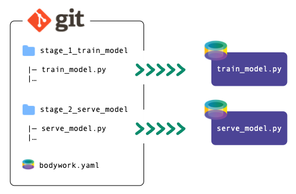

# Overview

Bodywork is a command line tool that deploys machine learning pipelines to [Kubernetes](https://en.wikipedia.org/wiki/Kubernetes). It takes care of everything to do with containers and orchestration, so that you don't have to.

## Who is this for?

Bodywork is aimed at teams who want a solution for running ML pipelines and deploying models to Kubernetes. It is a lightweight and simpler alternative to [Kubeflow](https://www.kubeflow.org), or to building your own platform based around a workflow orchestration tool like [Apache Airflow](https://airflow.apache.org), [Argo Workflows](https://argoproj.github.io/workflows/) or [Dagster](https://www.dagster.io).

## Pipeline = Jobs + Services

Any stage in a Bodywork pipeline can do one of two things:

- [x] **run a batch job**, to prepare features, train models, compute batch predictions, etc.
- [x] **start a long-running process**, like a Flask app that serves model predictions via HTTP.

You can use these to compose pipelines for many common ML use-cases, from serving pre-trained models to running continuous training on a schedule.

## No Boilerplate Code Required

Defining a stage is as simple as developing an executable Python module or Jupyter notebook that performs the required tasks, and then committing it to your project's Git repository. You are free to structure your codebase as you wish and there are no new APIs to learn.

## Easy to Configure

Stages are assembled into [DAGs](https://en.wikipedia.org/wiki/Directed_acyclic_graph) that define your pipeline's workflow. This and other key [configuration](user_guide.md#configuring-a-project-for-deployment-with-bodywork) is contained within a single [bodywork.yaml file](https://github.com/bodywork-ml/bodywork-ml-pipeline-project/blob/master/bodywork.yaml).

## Simplified DevOps for ML

Bodywork removes the need for you to build and manage container images for any stage of your pipeline. It works by running all stages using Bodywork's [custom container image](https://hub.docker.com/repository/docker/bodyworkml/bodywork-core). Each stage starts by pulling all the required files directly from your project's Git repository (e.g., from GitHub), pip-installing any required dependencies, and then running the stage's designated Python module (or Jupyter notebook).

## More Features

`Resilience`
: Bodywork handles automatic retries and roll-backs, without any downtime.

`Horizontal Scaling`
: Bodywork can back your service endpoints with as many container replicas as you need to handle your API traffic.

`Multi-Cloud`
: Bodywork deploys to Kubernetes clusters, which are available as managed services from all major cloud providers. Kubernetes is indifferent to where it is running, so changing cloud provider is as easy as pointing to a different cluster.

`Written entirely in Python`
: The native language of machine learning and data science, so your team can have full visibility of what Bodywork is doing and how.

`Open Source`
: Bodywork is built and maintained by machine learning engineers, for machine learning engineers, who are committed to keeping it 100% open-source.

Bodywork brings DevOps automation to your machine learning projects and will form the basis of your [Machine Learning Operations (MLOps)](https://en.wikipedia.org/wiki/MLOps) platform. It will ensure that your projects are always trained with the latest data, the latest available models are always deployed and your ML systems remain highly-available.

## We want your Feedback

If Bodywork sounds like a useful tool, then please give a **GitHub Star ★** to [bodywork-core](https://github.com/bodywork-ml/bodywork-core) and [contact us](contact.md) with your feedback.
