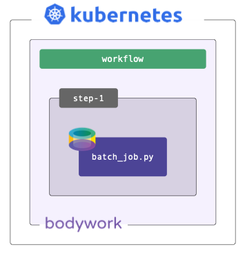
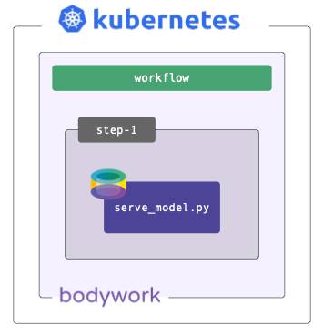
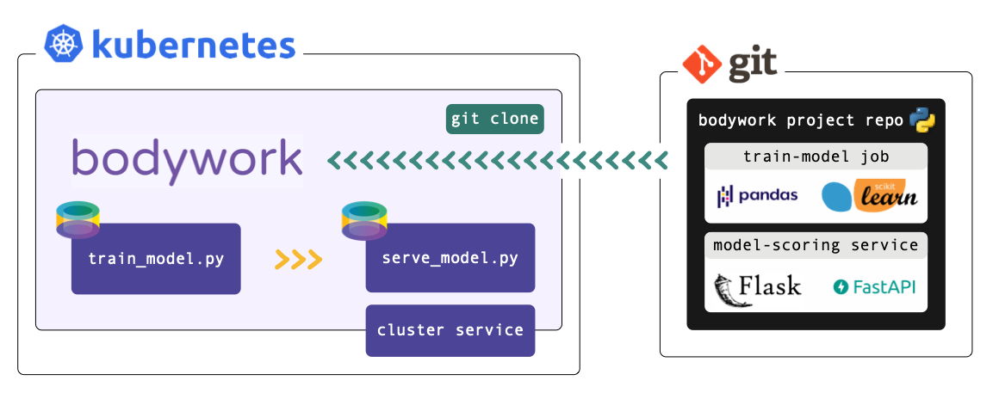

# Stages, Steps and Workflows


A ML pipeline is a series of stages (i.e. a workflow), that are executed to develop and deploy ML models.

## Stages

A stage is an executable Python module, or Jupyter notebook, executed within its own [Bodywork container](https://hub.docker.com/repository/docker/bodyworkml/bodywork-core), on Kubernetes. There are two different types of stage:

`Batch`
: For executing code that performs a set of discrete tasks, such as preparing features, training models or scoring a dataset. Batch stages have a well defined end and are automatically shut-down after they have finished.

`Service`
: For executing code that starts a long-running process, such as a [Flask](https://flask.palletsprojects.com/en/1.1.x/) app for serving predictions via HTTP. Service stages have no end and will be kept up-and-running, until they are deleted.

Each stage can be configured with its own set of Python requirements (pip-installed prior to execution), secrets (injected as environment variables), and runtime arguments.

## Steps

A **step** is a collection of one or more stages that can be run concurrently, such as training multiple models in parallel. Stages that must be executed only after another stage has finished, should be placed in consecutive steps.

## Workflows

A **workflow** is an ordered collection of one or more steps, that are executed sequentially. A step is only executed after all of the stages in the previous step have completed successfully. A workflow can be represented as a [Directed Acyclic Graph (DAG)](https://en.wikipedia.org/wiki/Directed_acyclic_graph) and will form the basis of all your pipelines.

## Examples

Common tasks realised with Bodywork pipelines.

### Batch Workload



Very often we just need to schedule a simple batch job - e.g., to train a model or score a dataset with a pre-trained model. Bodywork handles this scenario as a workflow consisting of a single batch stage, running within a single step.

### Deploying a Model



Sometimes models are trained off-line, or on external platforms, and all that's required is to deploy a service that exposes it via HTTP. Bodywork handles this scenario as a workflow consisting of a single service stage, running within a single step.

### Continuous Training Pipeline


Most ML projects can be described by one model training stage followed by a model serving stage. The training stage is executed in the first step and the serving stage in the second. This workflow can be used to automate the process of re-training models when new data becomes available, and to automatically re-deploy a prediction service that uses the newly-trained model.

## Deployment from Git Repos

Bodywork projects **must** be packaged as Git repositories, hosted on one of the following services: GitHub, GitLab, Azure DevOps or BitBucket. When a deployment is triggered, Bodywork will clone the repository, analyse the configuration provided in `bodywork.yaml`, and then orchestrate the execution of each stage in the pipeline.

Each stage is executed within a newly created [Python-enabled container](https://hub.docker.com/repository/docker/bodyworkml/bodywork-core), that starts by installing any 3rd party Python package dependencies that have been specified in `bodywork.yaml`, before running the chosen Python module (or Jupyter notebook).

At no point is there any need to build Docker images and push them to a container registry. This simplifies [CI/CD](https://en.wikipedia.org/wiki/CI/CD), so that you can focus on those aspects that are more relevant to your ML solution (such as model testing and validation).



Bodywork does not impact how you choose to structure and develop your projects. The only requirement for deploying a pipeline is to add a single `bodywork.yaml` file to your Git repository. This contains **all** of the configuration required to deploy the pipeline to Kubernetes.

Your Git repository will resemble a conventional Python project:

```text
continuous-training-pipeline/
|-- stage_1_train_model/
    |-- train_model.py
    |-- ...
|-- stage_2_serve_model/
    |-- serve_model.py
    |-- ...
|-- bodywork.yaml
```

Where:

`*.py`
: Executable Python modules that contain the code required for a stage.

`bodywork.yaml`
: Contains configuration data, such as which Python module to run for each stage, external Python packages that need to be installed, arguments to pass to modules, secret credentials, the workflow DAG, etc. These are covered in detail, in the [user guide](user_guide.md).

This project can then be configured to run on a schedule with one command,

```text
$ bodywork create cronjob "https://github.com/acme/my-ml-pipeline" \
    --schedule "* 0 * * *" \
    --name "midnight-run" \
    --retries 2
```

!!! info "Working with private Git repositories"
    The example above assumes the Git repository is public - for more information on working with private repositories, please see [here](user_guide.md#private-git-repositories).
