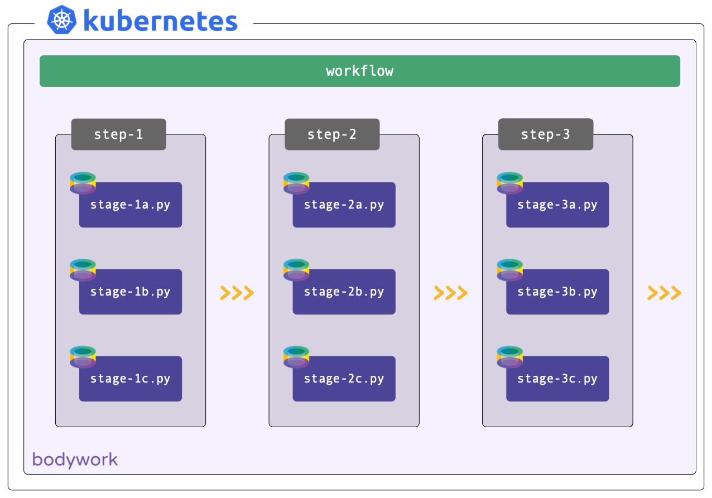
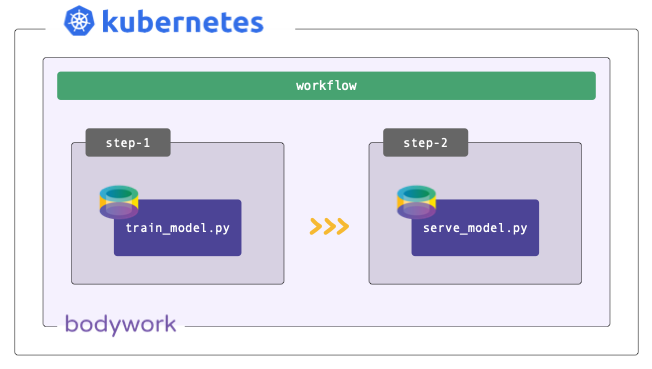

# Stages, Steps and Workflows

## Stages

Each task you want to run, such as training a model, scoring data or starting a model-scoring service, needs to be defined within an executable Python module. Each module defines a single **stage**. Bodywork will run each stage in its own pre-built [Bodywork container](https://hub.docker.com/repository/docker/bodyworkml/bodywork-core), on Kubernetes.

There are two different types of stage that can be created:

`Batch Stages`
: For executing code that performs a discrete task - e.g. preparing features, training a model or scoring a dataset. Batch stages have a well defined end and will be automatically shut-down after they have successfully completed.

`Service Stages`
: For executing code that starts a service - e.g. a [Flask](https://flask.palletsprojects.com/en/1.1.x/) application that loads a model and then exposes a REST API for model-scoring. Service stages are long-running processes with no end, that will be kept up-and-running until they are deleted.

## Steps

A **step** is a collection of one or more stages that can be running at the same time (concurrently). For example, when training multiple models in parallel or starting multiple services at once. Stages that should only be executed after another stage has finished, should be placed in different steps, in the correct order.

## Workflow

A **workflow** is an ordered collection of one or more steps, that are executed sequentially, where the next step is only executed after all of the stages in the previous step have completed successfully. A workflow can be represented as a [Directed Acyclic Graph (DAG)](https://en.wikipedia.org/wiki/Directed_acyclic_graph).

## Example: Batch Job

Workflows need not be complex and often all that's required is for a simple batch job to be executed - for example, to score a dataset using a pre-trained model. Bodywork handles this scenario as a workflow consisting of a single batch stage, running within a single step.

## Example: Deploy Service

Sometimes models are trained off-line, or on external platforms, and all that's required is to deploy a service that exposes them. Bodywork handles this scenario as a workflow consisting of a single service stage, running within a single step.

## Example: Train-and-Serve Pipeline

Most ML projects can be described by one model-training stage and one service deployment stage. The training stage is executed in the first step and the serving stage in the second. This workflow can be used to automate the process of re-training models as new data becomes available, and to automatically re-deploy the model-scoring service with the newly-trained model.

## Deployment from Git Repos

Bodywork requires projects to be stored and distributed as Git repositories - e.g. hosted on GitHub. It will clone the project repository directly and execute the stages (the executable Python modules) defined within it, according to how the workflow has been configured. At no point is there any need to build Docker images and push them to a container registry. This simplifies the [CI/CD](https://en.wikipedia.org/wiki/CI/CD) pipeline for your project, so that you can focus on the aspects (e.g. tests) that are more relevant to your machine learning task.

Bodywork does not impact how you choose to structure and engineer your projects. The only requirement for deploying a project with Bodywork, is to add a single `bodywork.yaml` file to your project's root directory. This file contains **all** of the configuration data required by Bodywork to deploy your project to Kubernetes. For the train-and-serve scenario discussed above, the project structure could be something like:

Where:

`*.py`
: Executable Python modules that run the code required by their stage.

`bodywork.yaml`
: Bodywork configuration data - for example, which Python module to use for each stage, external Python packages that need to be installed, arguments to pass to modules, secret credentials, the workflow DAG, etc. These are covered in detail, in the [user guide](user_guide.md)

This project can then be configured to run on a schedule with one command,

!!! info "Working with private Git repositories"
    The example above assumes the GitHub repository is public - for more information on working with private repositories, please see [here](user_guide.md#working-with-private-git-repositories-using-ssh).
