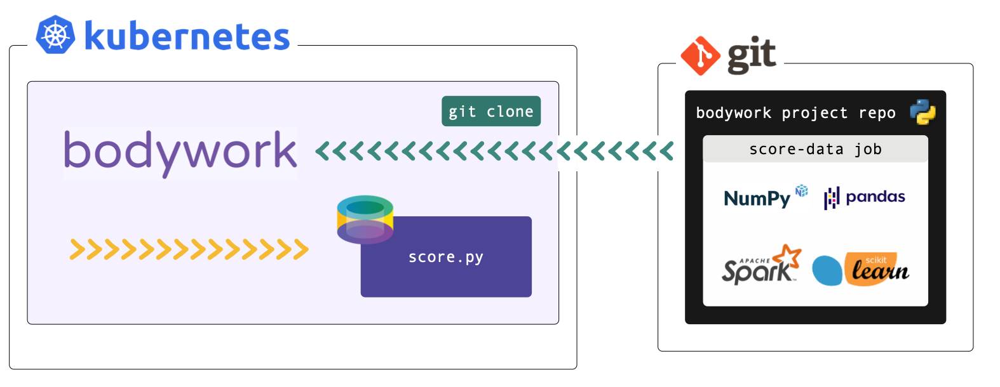

# Batch Workloads



## What am I going to Learn?

* [x] How to deploy a single stage pipeline to run a batch workload (or job) on Kubernetes.
* [x] How to schedule this job to run on daily basis.

## Before we Start

This tutorial refers to files within a Bodywork template project hosted on GitHub - check it out [here](https://github.com/bodywork-ml/bodywork-batch-job-project). If you want to run the examples you will need to [install Bodywork](installation.md) on your machine and setup access to Kubernetes (see the [Kubernetes Quickstart](kubernetes.md#quickstart) for help with this).

We **strongly** recommend that you find five minutes to read about the [key concepts](key_concepts.md) that Bodywork is built upon, before beginning to work-through the examples below.

!!! info "Working with private repositories"
    If you've cloned the example project into a private repository and intend to use this when following this tutorial, then you will need to be aware of the additional steps detailed [here](user_guide.md#private-git-repositories).

## Example Job - Batch Inference

The example task that we want to deploy as a batch job, is to load a pre-trained model and use it to score a dataset. The latest dataset will be downloaded from cloud storage (AWS S3) and the pre-trained model will be bundled into the project's Git repository for convenience (not as a best practice).

The project for this single-stage pipeline is structured as follows,

```text
root/
 |-- score_data/
     |-- score.py
     |-- classification_model.joblib
 |-- bodywork.yaml
```

## Configuring the Job

All the configuration for this deployment is held within `bodywork.yaml`, whose contents are reproduced below.

```yaml
version: "1.0"

project:
  name: bodywork-batch-job-project
  docker_image: bodyworkml/bodywork-core:latest
  DAG: score_data

stages:
  score_data:
    executable_module_path: score_data/score.py
    requirements:
      - boto3==1.16.15
      - joblib==0.17.0
      - pandas==1.1.4
      - scikit-learn==0.23.2
    cpu_request: 0.5
    memory_request_mb: 100
    batch:
      max_completion_time_seconds: 30
      retries: 2

logging:
  log_level: INFO
```

The `stages.score_data.executable_module_path` parameter points to the executable Python module - `score.py` - that defines what will happen when the `score_data` (batch) stage is executed, within a pre-built Bodywork container. This module contains the code required to:

1. download the new dataset from cloud storage (AWS S3);
2. load the pre-trained model `classification_model.joblib`;
3. score the dataset; and,
4. save the results back to cloud storage (AWS S3).

It can be summarised as,

```python
from urllib.request import urlopen

# other imports
# ...

DATA_URL = ('http://bodywork-batch-job-project.s3.eu-west-2.amazonaws.com'
            '/data/iris_classification_data.csv')

# other constants
# ...


def main() -> None:
    """Main script to be executed."""
    data = download_dataset(DATA_URL)
    model = load(TRAINED_MODEL_FILENAME)
    scored_data = score_data(data, model)
    upload_results(scored_data)


# other functions definitions used in main()
# ...


if __name__ == '__main__':
    main()
```

We recommend that you spend five minutes familiarising yourself with the full contents of [score.py](https://github.com/bodywork-ml/bodywork-batch-job-project/blob/master/score_data/score.py). When Bodywork runs the stage, it will do so in the same way as if you were to run,

```text
$ python score.py
```

And so everything defined in `main()` will be executed.

The `stages.score_data.requirements` parameter in `bodywork.yaml` lists the 3rd party Python packages that will be Pip-installed on the container, as required to run the `score.py` module. In this example we have,

```text
boto3==1.16.15
joblib==0.17.0
pandas==1.1.4
scikit-learn==0.23.2
```

* `boto3` - for interacting with AWS;
* `joblib` - for persisting models;
* `pandas` - for manipulating the raw data; and,
* `scikit-learn` - for training the model.

Finally, the remaining parameters in `stages.score_data` section of the `bodywork.yaml` file allow us to configure the remaining parameters for the stage,

```yaml
stages:
  score_data:
    executable_module_path: score_data/score.py
    requirements:
      - boto3==1.16.15
      - joblib==0.17.0
      - pandas==1.1.4
      - scikit-learn==0.23.2
    cpu_request: 0.5
    memory_request_mb: 100
    batch:
      max_completion_time_seconds: 30
      retries: 2
```

From which it is clear to see that we have specified that this stage is a batch stage (as opposed to a service stage), together with an estimate of the CPU and memory resources to request from the Kubernetes cluster, how long to wait and how many times to retry, etc.

## Configuring the Pipeline

The `project` section of `bodywork.yaml` contains the configuration for the whole pipeline, which in this case consists of a single stage as defined in the `stages.scoring_service` section of `bodywork.yaml`.

```yaml
project:
  name: bodywork-batch-job-project
  docker_image: bodyworkml/bodywork-core:latest
  DAG: score_data
```

The most important element is the specification of the workflow DAG, which in this instance is simple and will instruct the Bodywork workflow-controller to run the `score_data` stage.

## Deploying the Pipeline

To deploy the pipeline, use the following command,

```text
$ bw create deployment "https://github.com/bodywork-ml/bodywork-batch-job-project" "master"
```

Which will run the pipeline defined in the `master` branch of the project's remote Git repository and stream the logs to stdout - e.g,

```text
=========================================== deploying master branch from https://github.com/bodywork-ml/bodywork-batch-job-project ============================================
[02/21/22 12:25:31] INFO     Creating k8s namespace = bodywork-batch-job-project                                                                                               
[02/21/22 12:25:31] INFO     Creating k8s service account = bodywork-stage                                                                                                     
[02/21/22 12:25:31] INFO     Attempting to execute DAG step = [score_data]                                                                                                     
[02/21/22 12:25:31] INFO     Creating k8s job for stage = score-data                                                                                                           
...
```

You can also keep track of the pipeline's progress by using the Kubernetes dashboard and browsing to the namespace that matches the project name specified in `bodywork.yaml` - i.e., `bodywork-batch-job-project`.

## Scheduling the Pipeline

If you're happy with the results of this test deployment, you can then schedule the pipeline to run on the cluster, on a schedule. For example, to setup the the workflow to run every hour, use the following command,

```text
$ bw create cronjob "https://github.com/bodywork-ml/bodywork-batch-job-project" "master" \
    --name "hourly" \
    --schedule "0 * * * *" \
    --retries 2
```

Each scheduled pipeline execution will attempt to run the batch inference job, as defined by the state of this repository's `master` branch at the time of execution.

To get the execution history for this cronjob use,

```text
$ bw get cronjob "hourly" --history
```

Which should return output along the lines of,

```text
       workflow job = hourly-1645446900       
┏━━━━━━━━━━━━━━━━━┳━━━━━━━━━━━━━━━━━━━━━━━━━━━┓
┃ Field           ┃ Value                     ┃
┡━━━━━━━━━━━━━━━━━╇━━━━━━━━━━━━━━━━━━━━━━━━━━━┩
│ start_time      │ 2022-02-21 12:35:06+00:00 │
│ completion_time │ 2022-02-21 12:39:32+01:03 │
│ active          │ False                     │
│ succeeded       │ True                      │
│ failed          │ False                     │
└─────────────────┴───────────────────────────┘
```

Then to stream the logs from any given cronjob run (e.g. to debug and/or monitor for errors), use,

```text
$ bw get cronjobs hourly --logs "hourly-1645446900"
```
