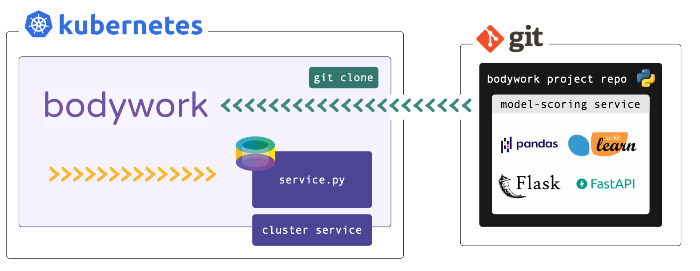

# Deploying a Model-Scoring Service



## What am I going to Learn?

* [x] How to deploy a prediction service that exposes a pre-trained model via a REST API.
* [x] How to test the prediction service.

## Before we Start

This tutorial refers to files within a Bodywork template project hosted on GitHub - check it out [here](https://github.com/bodywork-ml/bodywork-serve-model-project). If you want to run the examples you will need to [install Bodywork](installation.md) on your machine and setup access to Kubernetes (see the [Kubernetes Quickstart](index.md#prerequisites) for help with this).

We **strongly** recommend that you find five minutes to read about the [key concepts](key_concepts.md) that Bodywork is built upon, before beginning to work-through the examples below.

!!! info "Working with private repositories"
    If you've cloned the example project into a private repository and intend to use this when following this tutorial, then you will need to be aware of the additional steps detailed [here](user_guide.md#private-git-repositories).

This tutorial refers to files within a Bodywork project hosted on GitHub - check it out [here](https://github.com/bodywork-ml/bodywork-serve-model-project). If you want to execute the examples, you will need to have setup [access to a Kubernetes cluster](index.md#prerequisites) and [installed bodywork](installation.md) on your local machine.

## A REST API for Predicting Class

The example model that we want to serve returns the predicted sub-species of iris plant, given four of its critical dimensions as inputs. For more information on this ML task see ['Quickstart - Continuous Training Pipeline'](quickstart_ml_pipeline.md#the-ml-task).

The pipeline for this single stage service deployment workflow is packaged as a [GitHub repository](https://github.com/bodywork-ml/bodywork-serve-model-project), and is structured as follows,

```text
root/
 |-- scoring_service/
     |-- service.py
     |-- classification_model.joblib
 |-- bodywork.ini
```

We have added the pre-trained model to the project's Git repository for convenience (not as best practice).

## Configuring the Service

All the configuration for this deployment is held within `bodywork.yaml`, whose contents are reproduced below.

```yaml
version: "1.0"

project:
  name: bodywork-serve-model-project
  docker_image: bodyworkml/bodywork-core:latest
  DAG: scoring_service

stages:
  scoring_service:
    executable_module_path: scoring_service/service.py
    requirements:
      - Flask==1.1.2
      - joblib==0.17.0
      - numpy==1.19.4
      - scikit-learn==0.23.2
    cpu_request: 0.5
    memory_request_mb: 100
    service:
      max_startup_time_seconds: 30
      replicas: 2
      port: 5000
      ingress: true

logging:
  log_level: INFO
```

The `stages.scoring_service.executable_module_path` parameter points to the executable Python module - `service.py` - that defines what will happen when the `scoring_service` (service) stage is executed, within a pre-built Bodywork container. This module contains the code required to:

1. load the pre-trained model; and,
2. start a web service to score instances (or rows) of data, sent as JSON to an API endpoint.

We chose to develop the prediction service using [Flask](https://flask.palletsprojects.com/en/1.1.x/), but this is **not** a requirement in any way and you are free to use any frameworks you like - e.g., [FastAPI](https://fastapi.tiangolo.com).

The contents of `service.py` can be summarised as follows,

```python
from typing import Dict

# other imports
# ...

MODEL_PATH = 'bodywork_project/scoring-service/classification_model.joblib'

# other constants
# ...

app = Flask(__name__)


@app.route('/iris/v1/score', methods=['POST'])
def score() -> Response:
    """Iris species classification API endpoint"""
    request_data = request.json
    X = make_features_from_request_data(request_data)
    model_output = model_predictions(X)
    response_data = jsonify({**model_output, 'model_info': str(model)})
    return make_response(response_data)


# other functions definitions used in score() and below
# ...


if __name__ == '__master__':
    model = load(MODEL_PATH)
    print(f'loaded model={model}')
    print(f'starting API server')
    app.run(host='0.0.0.0', port=5000)
```

We recommend that you spend five minutes familiarising yourself with the full contents of [service.py](https://github.com/bodywork-ml/bodywork-serve-model-project/blob/master/scoring_service/service.py). When Bodywork runs the stage, it will do so in the same way as if you were to run,

```text
$ python service.py
```

And so it will start the server defined by `app` and expose the `/iris/v1/score` route that is being handled by `score()`. Note, that this process has no scheduled end and the stage will be kept up-and-running until it is re-deployed or [deleted](user_guide.md#deleting-services).

The `stages.scoring_service.requirements` parameter in `bodywork.yaml` lists the 3rd party Python packages that will be Pip-installed on the pre-built Bodywork container, as required to run the `service.py` module. In this example we have,

```text
Flask==1.1.2
joblib==0.17.0
numpy==1.19.4
scikit-learn==0.23.2
```

* `Flask` - the framework upon which the REST API server is built;
* `joblib` - for loading the persisted model;
* `numpy` & `scikit-learn` - for working with the ML model.

Finally, the remaining parameters in `stages.scoring_service` section of the `bodywork.yaml` file allow us to configure the remaining key parameters for the stage,

```yaml
stages:
  scoring_service:
    executable_module_path: scoring_service/service.py
    requirements:
      - Flask==1.1.2
      - joblib==0.17.0
      - numpy==1.19.4
      - scikit-learn==0.23.2
    cpu_request: 0.5
    memory_request_mb: 100
    service:
      max_startup_time_seconds: 30
      replicas: 2
      port: 5000
      ingress: true
```

From which it is clear to see that we have specified that this stage will start a service (as opposed to run a batch job), together with an estimate of the CPU and memory resources to request from the Kubernetes cluster, how long to wait for the service to start-up and be 'ready', which port to expose, to create a path to the service from an externally-facing ingress controller (if present in the cluster), and how many instances (or replicas) of the server should be created to stand-behind the cluster-service.

## Configuring the Pipeline

The `project` section of the `bodywork.yaml` file contains the configuration for the whole pipeline, which in this case consists of a single stage as defined in the `stages.scoring_service` section of `bodywork.yaml`.

```yaml
project:
  name: bodywork-serve-model-project
  docker_image: bodyworkml/bodywork-core:latest
  DAG: scoring_service
```

The most important element is the specification of the workflow DAG, which in this instance is simple and will instruct the Bodywork workflow-controller to run the `scoring_service` stage.

## Deploying the Pipeline

To deploy the pipeline and create the prediction service, use the following command,

```text
$ bw create deployment "https://github.com/bodywork-ml/bodywork-serve-model-project" "master"
```

Which will run the pipeline defined in the `master` branch of the project's remote Git repository and stream the logs to stdout - e.g,

```text
========================================== deploying master branch from https://github.com/bodywork-ml/bodywork-serve-model-project ===========================================
[02/21/22 13:09:08] INFO     Creating k8s namespace = bodywork-serve-model-project                                                                                             
[02/21/22 13:09:08] INFO     Creating k8s service account = bodywork-stage                                                                                                     
[02/21/22 13:09:08] INFO     Attempting to execute DAG step = [scoring_service]                                                                                                
[02/21/22 13:09:08] INFO     Creating k8s deployment and service for stage = scoring-service
...
```

## Testing the API

The details of any serviced associated with the pipeline, can be retrieved using,

```text
$ bw get deployment "bodywork-serve-model-project" "scoring-service"

┏━━━━━━━━━━━━━━━━━━━━━━┳━━━━━━━━━━━━━━━━━━━━━━━━━━━━━━━━━━━━━━━━━━━━━━━━━━━━━━━━━━━━━━━━━━━━━━━┓
┃ Field                ┃ Value                                                                 ┃
┡━━━━━━━━━━━━━━━━━━━━━━╇━━━━━━━━━━━━━━━━━━━━━━━━━━━━━━━━━━━━━━━━━━━━━━━━━━━━━━━━━━━━━━━━━━━━━━━┩
│ name                 │ scoring-service                                                       │
│ namespace            │ bodywork-serve-model-project                                          │
│ service_exposed      │ True                                                                  │
│ service_url          │ http://scoring-service.bodywork-serve-model-project.svc.cluster.local │
│ service_port         │ 5000                                                                  │
│ available_replicas   │ 2                                                                     │
│ unavailable_replicas │ 0                                                                     │
│ git_url              │ https://github.com/bodywork-ml/bodywork-serve-model-project           │
│ git_branch           │ master                                                                │
│ git_commit_hash      │ e9df4b4                                                               │
│ has_ingress          │ True                                                                  │
│ ingress_route        │ /bodywork-serve-model-project/scoring-service                         │
└──────────────────────┴───────────────────────────────────────────────────────────────────────┘
```

Services are accessible via the public internet if you have [installed an ingress controller](kubernetes.md#installing-nginx) within your cluster, and have set the `stages.STAGE_NAME.service.ingress` [configuration parameter](#service-deployment-stages) to `true`. If you are using Kubernetes via Minikube and our [Kuberentes Quickstart](kubernetes.md#quickstart) guide, then this will have been enabled for you. Otherwise, services will only be accessible via HTTP from **within** the cluster, via the `service_url`.

Assuming that you are setup to access services from outside the cluster, then you can test the endpoint using,

```text
$ curl http://YOUR_CLUSTERS_EXTERNAL_IP/bodywork-serve-model-project/scoring-service/iris/v1/score \
    --request POST \
    --header "Content-Type: application/json" \
    --data '{"sepal_length": 5.1, "sepal_width": 3.5, "petal_length": 1.4, "petal_width": 0.2}'
```

See [here](kubernetes.md#connecting-to-the-cluster) for instruction on how to retrieve `YOUR_CLUSTERS_EXTERNAL_IP`. This ought to return,

```json
{
    "species_prediction":"setosa",
    "probabilities":"setosa=1.0|versicolor=0.0|virginica=0.0",
    "model_info": "DecisionTreeClassifier(class_weight='balanced', random_state=42)"
}
```

According to how the payload has been defined in the `scoring-service/serve.py` module.

## Cleaning Up

To tear-down the prediction service created by the pipeline you can use,

```text
$ bw delete deployment "bodywork-serve-model-project"
```
