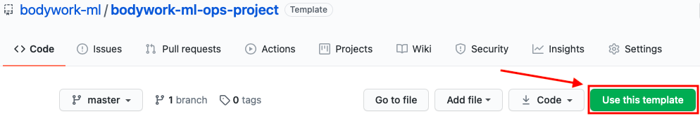

# Deployment Templates

To accelerate the development of your projects, we maintain a set of Bodywork deployment templates for common use-cases:

* [x] [batch scoring data](https://github.com/bodywork-ml/bodywork-batch-job-project)
* [x] [deploying a model as a prediction service with a REST API](https://github.com/bodywork-ml/bodywork-serve-model-project)
* [x] [scheduling a continuous training pipeline](https://github.com/bodywork-ml/bodywork-ml-pipeline-project)
* [x] [building pipelines with Jupyter notebooks](https://github.com/bodywork-ml/bodywork-jupyter-pipeline-project)
* [x] [serving machine learning dashboards](https://github.com/bodywork-ml/bodywork-ml-dashboard-project)

## Working with GitHub Template Repositories

Bodywork deployment templates are [GitHub template repositories](https://docs.github.com/en/free-pro-team@latest/github/creating-cloning-and-archiving-repositories/creating-a-repository-from-a-template) that can be automatically cloned into your own GitHub account by clicking the `Use this template` button shown below. If you don't use GitHub as your remote Git repo hosting service, then you will have to perform this operation manually.

From this point you will be able to deploy the Bodywork template project directly to Kubernetes using the steps in the project's `README`. You can then edit the files in the cloned template project to meet your own project's specific requirements.

!!! info "Working with private repositories"
    If you've cloned the example project into a private repository and intend to use this when following this tutorial, then you will need to be aware of the additional steps detailed [here](user_guide.md#private-git-repositories).
