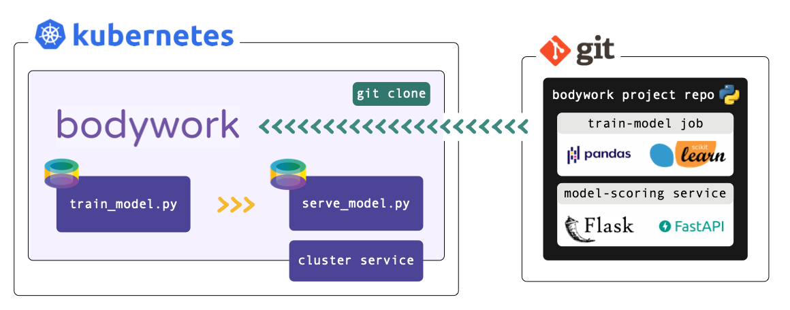

# User Guide

This is a comprehensive guide to deploying ML projects to Kubernetes using Bodywork. It assumes that you understand the [key concepts](key_concepts.md) that Bodywork is built upon and that you have worked-through the Quickstart Tutorials.

## Configuring a Project for Deployment with Bodywork

Bodywork does not impose **any** constraints on how your choose to structure or engineer your projects. So long as each stage in a workflow (or pipeline) can be backed by an executable Python module, then all Bodywork needs to deploy your project is configuration data contained with a `bodywork.yaml` file. This [YAML](https://yaml.org) based configuration file describes how Bodywork should deploy your project, and will be the main focus of this user guide.

As an example that we will frequently refer back to, consider the following project for a ML pipeline with the following distinct stages: prepare data (or features), train models (one module for SVMs and another one for Random Forests), perform model selection, and then deploy the chosen model as a microservice that exposes a REST API for scoring data:

```text
root/
 |-- prepare_data/
     |-- prepare_data.py
     |...
 |-- train_svm/
     |-- train_svm.py
     |...
 |-- train_random-forest/
     |-- train_random_forest.py
     |...
 |-- choose_model/
     |-- choose_model.py
     |...
 |-- model_scoring_service/
     |-- model_scoring_app.py
     |...
 |-- raise_alerts.py
 |-- bodywork.yaml
```

We have chosen to split the project into five directories, one for each stage, but this is not a requirement. There is also a single workflow configuration file, `bodywork.yaml`, whose contents are shown below and will be discussed in depth in each of the sections below:

```yaml
version: "1.0"
project:
  name: my-classification-project
  docker_image: bodyworkml/bodywork-core:latest
  DAG: prepare_data >> train_svm, train_random_forest >> choose_model >> model_scoring_service
  run_on_failure: send_notifications
stages:
  prepare_data:
    executable_module_path: prepare_data/prepare_data.py
    requirements:
      - boto3==1.16.15
      - pandas==1.1.4
    cpu_request: 0.5
    memory_request_mb: 100
    batch:
      max_completion_time_seconds: 30
      retries: 2
  train_svm:
    executable_module_path: train_svm/train_svm.py
    requirements:
      - boto3==1.16.15
      - pandas==1.1.4
      - joblib==0.17.0
      - scikit-learn==0.23.2
    cpu_request: 1.0
    memory_request_mb: 500
    batch:
      max_completion_time_seconds: 120
      retries: 2
  train_random_forest:
    executable_module_path: train_random_forest/train_random_forest.py
    requirements:
      - boto3==1.16.15
      - pandas==1.1.4
      - joblib==0.17.0
      - scikit-learn==0.23.2
    cpu_request: 2.0
    memory_request_mb: 750
    batch:
      max_completion_time_seconds: 120
      retries: 2
  choose_model:
    executable_module_path: choose_model/choose_model.py
    requirements:
      - boto3==1.16.15
      - joblib==0.17.0
      - numpy==1.19.4
      - scikit-learn==0.23.2
    cpu_request: 0.5
    memory_request_mb: 100
    batch:
      max_completion_time_seconds: 60
      retries: 2
  model_scoring_service:
    executable_module_path: model_scoring_service/model_scoring_app.py
    args: ["30", "ABC"]
    requirements:
      - Flask==1.1.2
      - joblib==0.17.0
      - numpy==1.19.4
      - scikit-learn==0.23.2
    secrets:
      USERNAME: my-classification-product-cloud-storage-credentials
      PASSWORD: my-classification-product-cloud-storage-credentials
    cpu_request: 0.25
    memory_request_mb: 100
    service:
      max_startup_time_seconds: 30
      replicas: 2
      port: 5000
      ingress: true
  send_notifications:
    executable_module_path: raise_alerts.py
    requirements:
      - requests==2.22.0
    cpu_request: 0.5
    memory_request_mb: 100
    batch:
      max_completion_time_seconds: 30
      retries: 1
logging:
  log_level: INFO
```

### Running Tasks in Remote Python Environments



Bodywork projects must be packaged as Git repositories, hosted on GitHub, GitLab, Azure DevOps or BitBucket. When a deployment is triggered, Bodywork starts a workflow-controller that clones the repository, analyses the configuration provided in `bodywork.yaml` and manages the execution of the workflow.

When the workflow-controller executes a stage, it starts a new [Python-enabled container](https://hub.docker.com/repository/docker/bodyworkml/bodywork-core) in your Kubernetes cluster, installs any 3rd party Python package dependencies that might be required, and then runs the chosen Python module.

## Configuring Workflows

All configuration for the workflow itself is contained within the `project` section of the `bodywork.yaml` file. From the example above we have,

```yaml
project:
  name: my-classification-project
  docker_image: bodyworkml/bodywork-core:latest
  DAG: prepare_data >> train_svm, train_random_forest >> choose_model >> model_scoring_service
  run_on_failure: send_notifications
```

Each configuration parameter is used as follows:

`name`
: This will be used to identify all Kubernetes resources deployed for this project.

`docker_image`
: The container image to use for remote execution of Bodywork workflows and stages. This should be set to `bodyworkml/bodywork-core:latest`, which will be pulled from [DockerHub](https://hub.docker.com/repository/docker/bodyworkml/bodywork-core).

`DAG`
: A description of the workflow structure - the stages to include in each step of the workflow - this will be discussed in more detail below.

`run_on_failure`
: An optional [batch stage](#batch-stages) to be run only after the workflow fails to complete successfully - i.e. when one of its stages fails. Within this stage's module you could trigger a webhook for [posting to Slack](https://api.slack.com/tutorials/slack-apps-hello-world), use the Python standard library to [send an e-mail](https://realpython.com/python-send-email/), or use the Python client for your company's chosen incident response platform (e.g. [PagerDuty](https://github.com/PagerDuty/pdpyras)). Note, that if Bodywork is unable to start the workflow for any reason (e.g. your cluster cannot access the Bodywork container image or your chosen namespace becomes unavailable), then it will **not** be able to run the chosen on-failure stage.

### Defining Workflow DAGs

The `DAG` string is used to control the execution of stages by assigning them to different steps of the workflow. Steps are separated using the `>>` operator and commas are used to delimit multiple stages within a single step (if this is required). Steps are executed from left to right. In the example above,

```ini
DAG=prepare-data >> train-svm, train-random-forest >> choose-model >> model-scoring-service
```

The workflow will be interpreted as follows:

- **step 1**: run `prepare_data`; then,
- **step 2**: run `train_svm` and `train_random_forest` in separate containers, in parallel; then,
- **step 3**: run `choose_model`; and finally,
- **step 4**: run `model_scoring_service`.

## Configuring Stages

The behavior of each stage is controlled by the configuration parameters in each stage subsection, within the `stages` section of the `bodywork.yaml` file. For the `model_scoring_service` stage in the example above, we have,

```yaml
stages:
  model_scoring_service:
    executable_module_path: model_scoring_service/model_scoring_app.py
    args: ["30", "ABC"]
    requirements:
      - Flask==1.1.2
      - joblib==0.17.0
      - numpy==1.19.4
      - scikit-learn==0.23.2
    secrets:
      USERNAME: my-classification-product-cloud-storage-credentials
      PASSWORD: my-classification-product-cloud-storage-credentials
    cpu_request: 0.25
    memory_request_mb: 100
    service:
      max_startup_time_seconds: 30
      replicas: 2
      port: 5000
      ingress: true
```

Every stage must have either a `batch` or `service` sub-section defined, depending on whether the stage is a batch stage or service stage, respectively. If `batch` is selected, then the executable Python module will be run as a discrete job (with a start and an end), and will be managed as a [Kubernetes job](https://kubernetes.io/docs/concepts/workloads/controllers/job/). If `service` is selected, then the executable script will be run as part of a [Kubernetes deployment](https://kubernetes.io/docs/concepts/workloads/controllers/deployment/) and will expose a [Kubernetes cluster-ip service](https://kubernetes.io/docs/concepts/services-networking/service/#publishing-services-service-types) to enable access over HTTP, within the cluster.

Top-level stage configuration parameters are to be used as follows:

`executable_module_path`
: The path to the executable Python module to run for the stage. Executable means that executing `python model_scoring_app.py` from the CLI would cause the module to run.

`args`
: An optional list of arguments to pass to the executable Python module (as strings).

`requirements`
: An optional list of Python package dependencies that need to be installed into the Python environment, for the executable module to run successfully. This is same list that you would normally specify in a `requirements.txt` file.

`cpu_request` and `memory_request_mb`
: The compute resources to request from the cluster in order to run the stage. For more information on the units used in these parameters [refer here](https://kubernetes.io/docs/concepts/configuration/manage-resources-containers/#resource-units-in-kubernetes).

The `secrets` sub-section is optional and is covered in more depth [below](#injecting-secrets).

### Batch Stages

An example `batch` stage configuration for the `prepare_data` stage could be as follows,

```yaml
stages:
  model_scoring_service:
    ...
    batch:
      max_completion_time_seconds: 30
      retries: 2
```

Where:

`max_completion_time_seconds`
: Time to wait for the given task to run, before retrying or raising a workflow execution error.

`retries`
: Number of times to retry executing a failed stage, before raising a workflow execution error.

### Service Deployment Stages

An example `service` configuration for the `model_scoring_service` stage could be as follows,

```yaml
stages:
  model_scoring_service:
    ...
    service:
      max_startup_time_seconds: 30
      replicas: 2
      port: 5000
      ingress: true
```

Where:

`max_startup_time_seconds`
: Time to wait for the service to be 'ready' without any errors having occurred. When the service reaches the time limit without raising errors, then it will be marked as 'successful'. If a service deployment stage fails to be successful, then the deployment will be automatically rolled-back to the previous version.

`replicas`
: Number of independent containers running the service started by the stage's executable Python module -  `model_scoring_app.py`. The service endpoint will automatically route requests to each replica in-turn.

`port`
: The port to expose on the container - e.g. Flask-based services usually send and receive HTTP requests on port `5000`.

`ingress`
: Whether or not to create a route (or path) from the cluster's externally-facing ingress controller, to this service. If set to `True`, it will enable external requests to reach the service via the ingress controller (acting as an API gateway), with the following URL,

: `http://YOUR_CLUSTERS_EXTERNAL_IP/NAMESPACE/SERVICE_STAGE_NAME`

: See [Configuring Ingress](kubernetes.md#configuring-ingress) for more information on exposing services to external HTTP requests.

### Injecting Secrets

Credentials will be required whenever you wish to pull data or persist models to cloud storage, access private APIs, etc. We provide a secure mechanism for dynamically injecting credentials as environment variables within the container running a stage.

The first step in this process is to store your project's secret credentials, securely within its namespace - see [Managing Credentials and Other Secrets](#managing-secrets) below for instructions on how to achieve this using Bodywork.

The second step is to configure the use of this secret with the `secrets` sub-section of a stage's configuration, within the `bodywork.yaml` file. For example,

```yaml
stages:
  model_scoring_service:
    ...
    secrets:
      USERNAME: my-classification-product-cloud-storage-credentials
      PASSWORD: my-classification-product-cloud-storage-credentials
```

Will instruct Bodywork to look for values assigned to the keys `USERNAME` and `PASSWORD` within the Kubernetes secret named `my-classification-product-cloud-storage-credentials`. Bodywork will then assign these secrets to environment variables within the container, called `USERNAME` and `PASSWORD`, respectively. These can then be accessed from within the stage's executable Python module - for example,

```python
import os


if __name__ == '__main__':
    username = os.environ['USERNAME']
    password = os.environ['PASSWORD']
```

## Configuring Logging

Logging configuration is contained within the `logging` section of the `bodywork.yaml` file. From the example above we have,

```yaml
logging:
  log_level: INFO
```

Where:

`log_level`
: Must be one of: `DEBUG`, `INFO`, `WARNING`, `ERROR` or `CRITICAL`. This is used to set the types of log message to stream to the workflow-controller's standard output stream (stdout).

## Validating the `bodywork.yaml` Configuration File

The `bodywork.yaml` file can be checked for errors by issuing the following command from the CLI,

```text
$ bodywork validate --check-files
```

The optional `--check-files` flag will check that all `executable_module_path` paths map to files that exist and can be reached by Bodywork, from the root directory where `bodywork.yaml` is located (assumed to be current working directory). Validation errors will be reported in the terminal.

## Configuring Namespaces

Each Bodywork project should operate within its own [namespace](https://kubernetes.io/docs/concepts/overview/working-with-objects/namespaces/) in your Kubernetes cluster. To setup a Bodywork compatible namespace, issue the following command from the CLI,

```text
$ bodywork setup-namespace my-classification-product
```

Which will yield the following output,

```text
creating namespace=my-classification-product
creating service-account=bodywork-workflow-controller in namespace=my-classification-product
creating cluster-role-binding=bodywork-workflow-controller--my-classification-product
creating service-account=bodywork-jobs-and-deployments in namespace=my-classification-product
```

We can see that in addition to creating the namespace, two [service-accounts](https://kubernetes.io/docs/tasks/configure-pod-container/configure-service-account/) will also be created. This will grant containers in `my-classification-product` the appropriate authorisation to run workflows, batch jobs and deployments within the newly created namespace. Additionally, a [binding to a cluster-role](https://kubernetes.io/docs/reference/access-authn-authz/rbac/) is also created. This will enable containers in the new namespace to list all available namespaces on the cluster. The cluster-role will be created if it does not yet exist.

## Managing Secrets

Credentials will be required whenever you wish to pull data or persist models to cloud storage, or access private APIs from within a stage. We provide a secure mechanism for dynamically injecting secret credentials as environment variables into the container running a stage. Before a stage can be configured to inject a secret into its host container, the secret has to be placed within the Kubernetes namespace that the workflow will be deployed to. This can be achieved from the command line - for example,

```text
$ bodywork secret create \
    --namespace=my-classification-product \
    --name=my-classification-product-cloud-storage-credentials \
    --data USERNAME=bodywork PASSWORD=bodywork123!
```

Will store `USERNAME` and `PASSWORD` within a [Kubernetes secret resource](https://kubernetes.io/docs/concepts/configuration/secret/) called `my-classification-product-cloud-storage-credentials` in the `my-classification-product` namespace. To inject `USERNAME` and `PASSWORD` as environment variables within a stage, see [Injecting Secrets into Stage Containers](#injecting-secrets) below.

### Working with Private Git Repositories using SSH

When working with remote Git repositories that are private, Bodywork will attempt to access them via [SSH](https://en.wikipedia.org/wiki/SSH_(Secure_Shell)). For example, to setup SSH access for use with GitHub, see [this article](https://devconnected.com/how-to-setup-ssh-keys-on-github/). This process will result in the creation of a private and public key-pair to use for authenticating with your remote Git host. The private key must be stored as a Kubernetes secret in the project's namespace, using the following naming convention for the secret name and secret data key,

```text
$ bodywork secret create \
    --namespace=my-classification-product \
    --name=ssh-git-private-key \
    --data BODYWORK_GIT_SSH_PRIVATE_KEY=paste_your_private_key_here
```

A convenient way to assign this variable direct from a private key file, e.g. one stored in `~/.shh/id_rsa`, is to use `BODYWORK_GIT_SSH_PRIVATE_KEY="$(cat ~/.shh/id_rsa)"`.

When executing a workflow defined in a private Git repository, make sure to use the SSH protocol when specifying the `git-repo-url` - e.g. use,

```text
git@github.com:my-github-username/my-classification-product.git
```

As opposed to,

```text
https://github.com/my-github-username/my-classification-product
```

## Accessing the Project's Git Commit Hash for Tagging ML Artefacts

The Git commit hash of your project can be accessed from within any Bodywork container, via the `GIT_COMMIT_HASH` environment variable. This allows you to tag any artefacts produced by your pipelines, such as datasets and trained models, with the precise version of the pipeline used to create them. For example,

```python
import os

git_hash = os.getenv('GIT_COMMIT_HASH')
model_filename = f'my-classifier--pipeline={git_hash}.pkl'
save_model(model, model_filename)
```

## Testing Workflows Locally

Workflows can be triggered locally from the command line, with the workflow-controller logs streamed to your terminal. In this mode of operation, the workflow-controller is operating on your local machine, but it is still orchestrating containers on Kubernetes remotely. It will still clone your project from the specified branch of the Bodywork project's Git repository, and delete it when finished.

For the example project used throughout this user guide, the CLI command for triggering the workflow locally using the `master` branch of the remote Git repository, would be as follows,

```text
$ bodywork deployment create \
    --namespace=my-classification-product \
    --name=test-deployment \
    --git-repo-url=https://github.com/my-github-username/my-classification-product \
    --git-repo-branch=master \
    --local-workflow-controller
```

### Testing Service Deployments

A brief summary of all service-related information can be retrieved by issuing,

```text
$ bodywork service display \
    --namespace=my-classification-product
```

Which will yield output like,

```text
-------------------------------------------------
my-classification-product--model-scoring-service:
-------------------------------------------------
|- GIT_URL               https://github.com/my-github-username/my-classification-product
|- GIT_BRANCH            master
|- REPLICAS_AVAILABLE    1
|- REPLICAS_UNAVAILABLE  0
|- EXPOSED_AS_SERVICE    true
|- CLUSTER_SERVICE_URL   http://my-classification-product--model-scoring-service.my-classification-product.svc.cluster.local
|- CLUSTER_SERVICE_PORT  5000
|- INGRESS_CREATED       true
|- INGRESS_ROUTE         /my-classification-product/my-classification-product--model-scoring-service
```

Service deployments are accessible via HTTP from within the cluster - they cannot be exposed to the public internet, unless you have [installed an ingress controller](kubernetes.md#configuring-ingress) in your cluster. The simplest way to test a service from your local machine, is by using a local [proxy server](https://kubernetes.io/docs/tasks/extend-kubernetes/http-proxy-access-api/) to enable access to your cluster. This can be achieved by issuing the following command,

```text
$ kubectl proxy
```

Then in a new shell, you can use the `curl` tool to test the service. For example, issuing,

```text
$ curl http://localhost:8001/api/v1/namespaces/my-classification-product/services/my-classification-product--model-scoring-service/proxy \
    --request POST \
    --header "Content-Type: application/json" \
    --data '{"x": 5.1, "y": 3.5}'
```

Should return the payload according to how you've defined your service in the executable Python module - e.g. in the `model_scoring_app.py` file.

If you have installed an ingress controller in your cluster, and if the the `stages.STAGE_NAME.service.ingress` [configuration parameter](#service-deployment-stages) has been set to `true`, then the service can be tested via the public internet using,

```text
$ curl http://YOUR_CLUSTERS_EXTERNAL_IP/my-classification-product/my-classification-product--model-scoring-service/ \
    --request POST \
    --header "Content-Type: application/json" \
    --data '{"x": 5.1, "y": 3.5}'
```

See [here](kubernetes.md#connecting-to-the-cluster) for instruction on how to retrieve `YOUR_CLUSTERS_EXTERNAL_IP`.

### Deleting Service Deployments

Once you have finished testing, you may want to delete any service deployments that have been created. To list all active service deployments within a namespace, issue the command,

```text
$ bodywork service display \
    --namespace=my-classification-project
```

Then to delete a service deployment use,

```text
$ bodywork service delete
    --namespace=my-classification-project
    --name=my-classification-product--model-scoring-service
```

### Workflow-Controller Logs

All logs should start in the same way,

```text
2020-11-24 20:04:12,648 - INFO - workflow.run_workflow - attempting to run workflow for project=https://github.com/my-github-username/my-classification-product on branch=master in kubernetes namespace=my-classification-product
2020-11-24 20:04:15,579 - INFO - workflow.run_workflow - attempting to execute DAG step=['prepare-data']
2020-11-24 20:04:15,580 - INFO - workflow.run_workflow - creating job=my-classification-product--prepare-data in namespace=my-classification-product
...
```

After a stage completes, you will notice that the logs from within the container are streamed into the workflow-controller logs. For example,

```text
----------------------------------------------------------------------------------------------------
---- pod logs for my-classification-product--prepare-data
----------------------------------------------------------------------------------------------------
2020-11-24 20:04:18,917 - INFO - stage.run_stage - attempting to run stage=prepare-data from master branch of repo at https://github.com/my-github-username/my-classification-product
...
```

The aim of this log structure is to provide a useful way of debugging workflows out-of-the-box, without forcing you to integrate a complete logging solution. This is not a replacement for a complete logging solution - e.g. one based on [Elasticsearch](https://www.elastic.co/observability). It is intended as a temporary solution to get your ML projects operational, as quickly as possible.

## Deploying Workflows

Workflows can be executed remotely using,

```text
$ bodywork deployment create \
    --namespace=my-classification-product \
    --name=initial-deployment \
    --git-repo-url=https://github.com/my-github-username/my-classification-product \
    --git-repo-branch=master \
    --retries=2
```

You can check on the status of the deployment using,

```text
$ bodywork deployment display \
    --namespace=my-classification-product
```

Which will yield output like,

```text
JOB_NAME              START_TIME                    COMPLETION_TIME               ACTIVE      SUCCEEDED       FAILED
initial-deployment    2020-12-11 20:21:04+00:00     2020-12-11 20:23:12+00:00     0           1               0
```

And retrieve the logs using,

```text
$ bodywork deployment logs \
    --namespace=my-classification-product \
    --name=initial-deployment
```

Which will stream logs directly to your terminal. This output stream could also be redirected to a local file by using a shell redirection command such as,

```text
$ bodywork deployment logs ... > log.txt
```

To overwrite the existing contents of `log.txt`, or,

```text
$ bodywork deployment logs ... >> log.txt
```

To append to the existing contents of `log.txt`.

After your deployment has completed, you can clean-up the job used to run the remote workflow-controller using,

```text
$ bodywork deployment delete_job \
    --namespace=my-classification-product \
    --name=initial-deployment
```

As not all clusters are configured to clean-up these jobs up automatically, so the cluster resources allocated to them will need to be freed-up manually.

## Scheduling Workflows

If your workflows are executing successfully, then you can schedule the workflow-controller to operate remotely on the cluster as a [Kubernetes cronjob](https://kubernetes.io/docs/concepts/workloads/controllers/cron-jobs/). For example, issuing the following command from the CLI,

```text
$ bodywork cronjob create \
    --namespace=my-classification-product \
    --name=my-classification-product \
    --schedule="0,15,30,45 * * * *" \
    --git-repo-url=https://github.com/my-github-username/my-classification-product \
    --git-repo-branch=master \
    --retries=2
```

Would schedule our example project to run every 15 minutes. The cronjob's execution history can be retrieved from the cluster using,

```text
$ bodywork cronjob history \
    --namespace=my-classification-product \
    --name=my-classification-product
```

Which will yield output along the lines of,

```text
JOB_NAME                                START_TIME                    COMPLETION_TIME               ACTIVE      SUCCEEDED       FAILED
my-classification-product-1605214260    2020-11-12 20:51:04+00:00     2020-11-12 20:52:34+00:00     0           1               0
```

### Accessing Historic Logs

The logs for each job executed by the cronjob are contained within the remote workflow-controller. The logs for a single workflow execution attempt can be retrieved by issuing the `bodywork cronjob logs` command on the CLI - for example,

```text
$ bodywork cronjob logs \
    --namespace=my-classification-product-1605214260 \
    --name=my-classification-product-1605214260
```

Would stream logs directly to your terminal, from the workflow execution attempt labelled `my-classification-product-1605214260`, in precisely the same way as was described for the `bodywork deployment logs` command [described above](#deploying-workflows).

### Bodywork Analytics

We collect basic usage statistics to help us understand adoption of Bodywork as a deployment tool. Every time you run a workflow, Bodywork will ping a remote server to increment a counter (nothing more). We do not store any data about you or your workflows (not even your IP address). You can see the code for this [here](https://github.com/bodywork-ml/bodywork-core/blob/bae4256e4b122f0aee43cfe4f11ceafc6150768d/src/bodywork/workflow_execution.py#L404). If you wish to disable this, then set `project.usage_stats: false` in your `bodywork.yaml` file.
